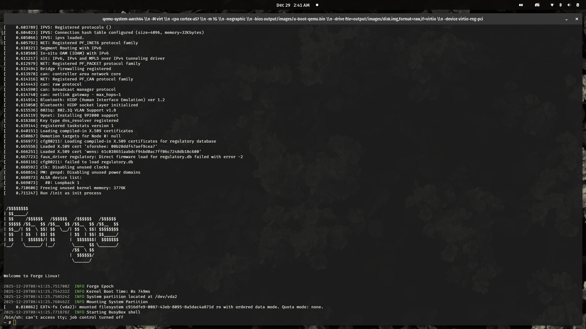

# Forge Linux

Build scripts for Forge Linux.

Forge Linux is the Distro im working on that I use on my boards for
personal projects. It is a Linux distro targeted for Embedded Systems
with with declarative system configuration and A/B system imaging.

A Forge image consists of three partitions:

- `boot`
  - **U-Boot**: Boot Loader, part of chain of trust
  - **Linux Kernel**: 6.18 LTS
  - **initamfs**: `epoch` initramfs, the boot supervisor and init system
    responsible for assembling and deploying OS images. This entails
    assembling the runtime rootfs, secure boot, updates, and recovery environment
- `system`: System partition, contains A/B image scheme for updating and swapping
  - **Image A**: Base OS Image 1
  - **Image B**: Base OS Image 2
  - ... Configurable mount of N images
- `state`: Contains persistent state
  - **App Bundles**: Packages are provided as readonly squashfs/erofs. `epoch` is
    responsible for mounting/overlaying the desired app bundles on top of the
    base `system` image, as well as setting up capabilities and sandboxing.
    Multiple versions of the same app can exist, allowing for rollbacks when needed.
    This design is similar to NixOS and Nix Store.
    - **App Bundle Store**: Content addressed store. Stores the SquashFS archives
      for each app bundle
    - **App Bunndle Policy**: effective policy/capabilities for the app bundle.
  - **Persistent Data**: Persistent data used by applications and system. Overlaid
    on top of base and app bundles.
  - **Forge Metadata**: Persistent metadata used by Forge and its systems.
    - **Updates**: Staging directory for updates.
    - **Logs**: Boot events and logs.
    - **System Configuration**: Declarative system configurations. Read by `epoch`
      and dictates the runtime rootfs.

